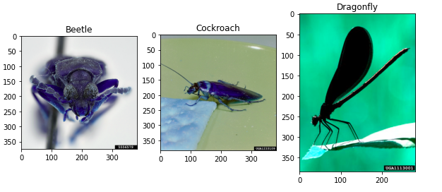

In this blog, I will show you how we can use transfer learning to classify beetles, cockroaches and dragonflies using this [image data](https://www.insectimages.org/index.cfm). 

👩‍💻 The code and image data can be found [here](https://github.com/Klalena/BIOS823-Statistical_Programming-for-Big-Data/tree/master/Homework/Insect_classification).

First, let's look at samples of our data. Here are sample images thee type of insects. 

We will use transfer learning with VGG16 to classify the insects. [Transfer Learning](https://en.wikipedia.org/wiki/Transfer_learning) means that knowledge gained while solving one problem is leveraged to solve some other related problem. In our case, we will use  VGG16 model which is pre-trained on ImageNet dataset. Whooh, too much jargon. Let's break it down a bit. 

**VGG16**: A convolutional neural network that has 16 layers, which was proposed in Oxford paper *Very Deep Convolutional Networks for Large-Scale Image Recognition* and had 93% accuracy in ImageNet. 

It's composed of ...

​																		*Image from https://neurohive.io/*

**ImageNet**: Database of around *15* million images with more than 1000 classes. 

**Pre-training**: After a model is trained, the optimized parameters can be used to solve other tasks. For example, it took weeks to train VGG16. 

