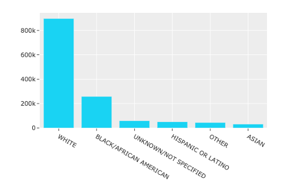
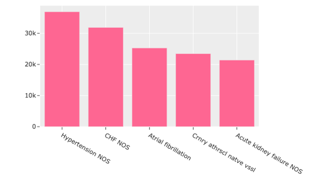
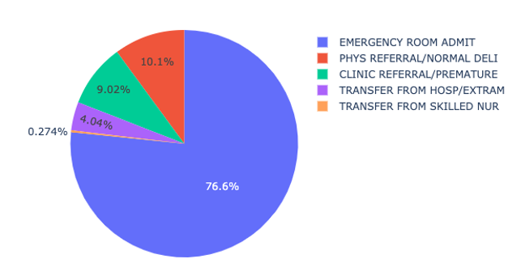

This blog presents the dashboard on the [MIMIC-III dataset](https://mimic.physionet.org), which is a final team project for the [BIOSTAT823 Statistical Programming for Big Data](https://github.com/cliburn/bios-823-2020) course at Duke University.  I wanted to give credit to my teammates (Cassie Wu, Felipe Buchbinder, and Joe Krinke) who made this project possible. 

Our primary goal was to produce a dashboard for Physicians and Hospital Administrators. With the help of the dashboard they can identify disease trends within demographics for better allocation of resources to reach people in need. It will help them to understand whether disease prevalence differs by demographics (ethnicity and gender). If the prevalence of diseases differs significantly among demographic characteristics, hospital administrators could leverage this information to better understand the health needs of different demographic groups in their local community. 

Also, this dashboard can help to identify which diseases are occurring together. This information could be useful for physicians and can be used to investigate potential preventative care options. 

The demo of the app presented below: 

<video autoplay width="100%" height="400" controls="controls" preload="none">
      <!-- MP4 for Safari, IE9, iPhone, iPad, Android, and Windows Phone 7 -->
      <source type="video/mp4" src="/assets/img/Dashboard_on_MIMIC/app_demo.mp4" />
  </video>

👩‍💻 You can find the code for our dashboard [here](https://github.com/Klalena/MIMIC-Analysis).

# Data and Workflow 

The data for the analysis comes from the MIMIC-III Critical Care Database, which was developed by the MIT Lab for Computational Physiology and contains health-related data of over 60, 000 patients who stayed in critical care units in Beth Israel Deaconess Medical Center (Boston, MA) between 2001 and 2012 [1].  The dataset contains data on patients’ demographics, diagnoses, prescriptions, admission details, and other health-related information. Figure 1 below displays the workflow for this project, where three main tools were used to create a dashboard: Amazon Web Services (AWS) to access data, Python for the analysis, and Streamlit to create and deploy the dashboard.

*Figure 1: MIMIC Project Workflow*   

# EDA 

In this blog, I will only highlight a few interesting findings form the dashboard. 

The first finding from the EDA is the dominance of White patients in the hospital. Figure 2 below shows that the majority of patients were White, while there were only a few thousand Asian patients. This could indicate that the geographic area where Beth Israel Deaconess Medical Center is located in an affluent area, which is primarily populated by White citizens.

*Figure 2: Patients by Ethnicity (MIMIC dataset)*

Delving into disease composition, the top five most common diseases relate to either heart, blood, or kidney problems. As can be seen from Figure 3 below, the top 5 most common disease are Hypertension NOS (Not Otherwise Specified), CHF NOS (Congestive heart failure), Atrial Fibrillation, Coronary atherosclerosis of native coronary artery (abbreviated as Crnry athrsci natve vssi in the figure 3), and Acute Kidney Failure

 

*Figure 3: Top 5 most common diseases in MIMIC dataset*

The third finding from the EDA is that the most frequent diseases differ by race. This is most prominent between White and Black. For example, as can be seen from Figure 4, the top five most common diseases for white patients are consistent with the top five for all patients (Figure 3). However, the second most common disease for Black patients is End Stage Renal disease, which is not even included in the top ten common diseases for white patients (Figure 4). 

*Figure 4: Top 10 most common diseases for White (left) and Black (right)* 

End Stage Renal disease is a chronic kidney disease at an advanced stage where kidneys lost most function [2].  Commonly, there are no symptoms for End Stage Renal disease, and it is usually diagnosed by a blood test.  Many Black patients may not have primary care doctors and, therefore, were possibly not diagnosed and treated for this disease. Therefore, the patients might be more likely to be diagnosed for this disease during emergency room admission as compared to White patients who are more likely to have primary doctors and would therefore receive treatment for kidney disease before it progresses to End Stage Renal disease. 

The data support this argument that patients are mainly diagnosed with End Stage Renal disease during emergency room admissions as compared to other diseases. As Figure 5 below shows, emergency room admissions account for around 77% of the admission locations for End Stage Renal disease. This is substantially higher as compared to the other most common diseases such as Hypertension NOS and Atrial Fibrillation, where emergency room admissions account for around 67% of cases. 

In conclusion, the findings from the EDA described above indicate that Black patients are more likely to have the most common diseases as compared to White patients, possibly indicating that Black patients choose to go to the hospital only when their health is in a critical condition. This could potentially be due to economic disparity between White and Black populations. However, since the analysis was conducted only on the dataset from one hospital located in Boston, these findings cannot yet be generalized to different hospitals. To overcome this limitation, further research should compare whether these patterns persist among other similar hospitals.

**References**

[1]    A. E. W. Johnson *et al.*, “MIMIC-III, a freely accessible critical care database,” *Sci. Data*, vol. 3, no. 1, p. 160035, Dec. 2016, doi: 10.1038/sdata.2016.35.

[2]    “End-stage renal disease - Symptoms and causes,” *Mayo Clinic*. https://www.mayoclinic.org/diseases-conditions/end-stage-renal-disease/symptoms-causes/syc-20354532 (accessed Nov. 15, 2020).

